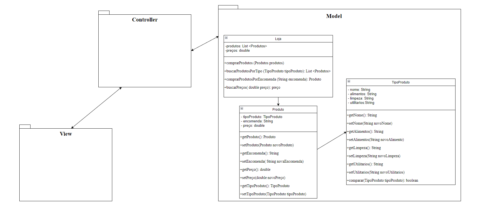

<h2> Text about Software Engineering </h2>

 "We see three critical differences between programming and software engineering: time, scale, and the trade-offs at play. On a software engineering project, 
  engineers need to be more concerned with the passage of time and the eventual need for change. In a software engineering organization, 
  we need to be more concerned about scale and efficiency, both for the software we produce as well as for the organization that is 
  producing it. Finally, as software engineers, we are asked to make more complex decisions with higher-stakes outcomes, often based 
  on imprecise estimates of time and growth. Within Google, we sometimes say, “Software engineering is programming integrated over time.” 
  Programming is certainly a significant part of software engineering: after all, programming is how you generate new software in the first place. 
  If you accept this distinction, it also becomes clear that we might need to delineate between programming tasks (development) and software engineering 
  tasks (development, modification, maintenance). The addition of time adds an important new dimension to programming. Cubes aren’t squares, distance isn’t velocity. 
  Software engineering isn’t programming." 

 Titus Winters, Software Engineering at Google 

<h2> Comentário: </h2>

 A Engenharia de Software abrange um conceito mais amplo do que a própria programação em si, além de desenvolver o software, um engenheiro tem que se preocupar com a escala e a eficiência do programa e da organização que o produz, além de estimular resultados e simular situações.

 

<h2> Qual é o trade-off em relação ao API: </h2>

 Em relação ao API e com as tecnologias requiridas, o trade-off seria na ligação e controle com o banco de dados, visto que existem outras linguagens de programação mais eficazes em fazer essa transição com o banco de dados e também no controle de modelação de dados fornecidos pelo cliente durante o registro na aplicação. 

 

<h2> Requisitos Funcionais e Não-Funcionais de aplicativo de entrega de alimentos: </h2>

<h3> Requisitos Funcionais: </h3>

 • Realizar pesquisa de alimentos. 

 • Solicitar entrega delivery. 

 • Pesquisar preço de alimentos. 

 • Solicitar descontos e diferentes meios de pagamentos.

 • Realizar compras mensais em mercados cadastrados.

 • Comprar medicamentos de forma rápida e intuitiva.

 • Encomendar produtos e retira-los imediatamente na loja. 

 

<h3> Requisitos Não-Funcionais: </h3>

 • Contato rápido com o suporte.

 • Acompanhamento do pedido em tempo-real. 

 • Feedback do aplicativo com o cliente. 

 • Plataforma rápida e intuitiva.

 • Funcionários de prontidão para o atendimento online. 

 • Custo-benefício em torno do aplicativo e dos produtos.

<h1> 20/10/2022 - Diagrama de Classes de Loja de Vendas de Produtos </h1>

<h1> 08/11/2022 - Diagrama de Casos de Uso </h1>

