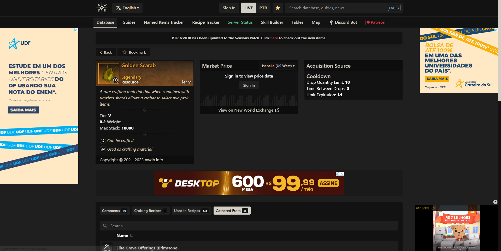
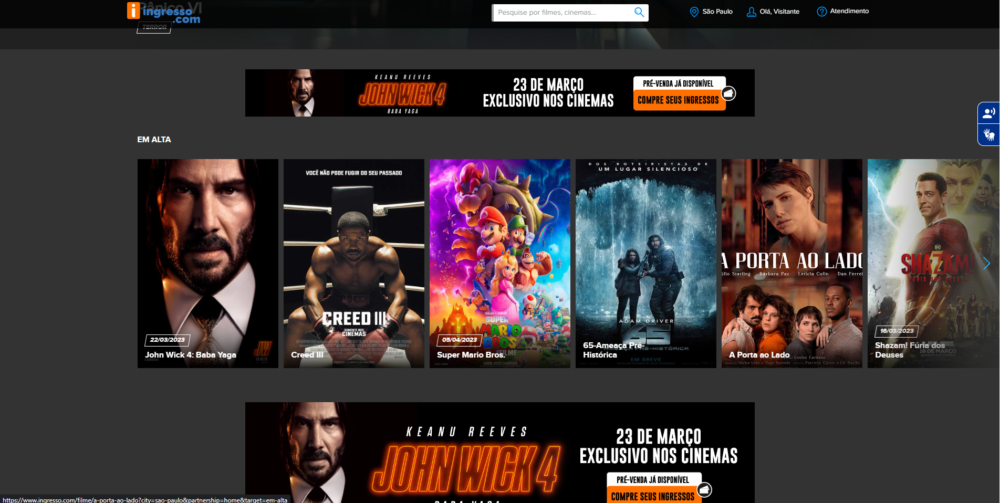

<h1> Avaliação Heuristica GUI </h1>

<h2> Imagem 1: </h2>

 <b> Site com design confuso e desorganizado, existem muitas informações e anúncios, o que dificulta a visibilidade e navegação do usuário. <b> 

<h2> Imagem 2: </h2>

<b> Site com excesso de anúncios desnecessários, site da Globo com propaganda desnecessária, mesmo que o usuário seja assinante do serviço ele ainda recebe anúncios. <b>

<h2> Imagem 3: </h2>

<b> Site com textos muito pequenos dificultando a leitura das informações, nesse caso, é o Siga, site de gerenciamento de matrícula.<b>

<h2> Imagem 4: </h2>

<b> Site com uma navegação muito complicada, este site é de venda de ingressos, caso a pessoa queira ver somente o preço do ingresso ou a as cadeiras disponíveis na sessão, ela terá que responder uma série de protocolos antes de verificar a informação.<b>

<h2> Imagem 5: </h2>

<b> Site com formulários complicados ou desnecessários, esse formulário de feedback possui informações desnecessárias como preenchimento de E-mail e data, coisas que não tem relevância em um questionário de feedback sobre algum serviço ou empresa. <b>

<h2> Imagem 6: </h2>

<b> Aplicativo com interface minimalista, a aplicação mobile do LinkedIn possui um visual minimalista, o que dificulta a usabilidade do sistema. <b>

