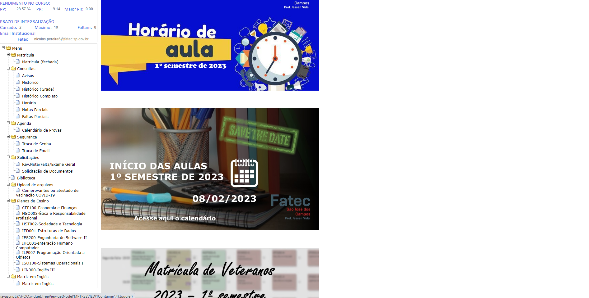
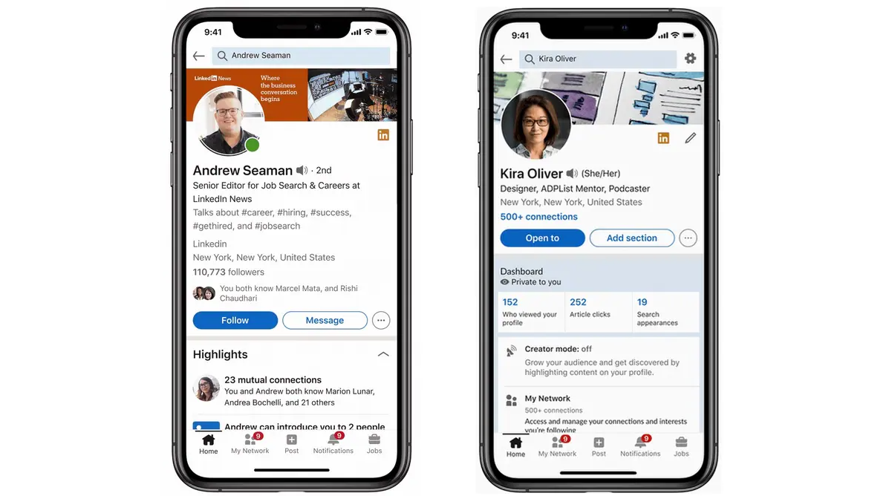
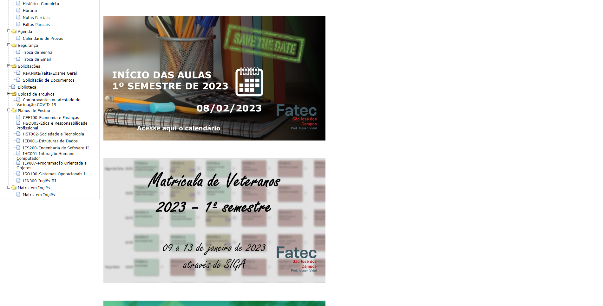
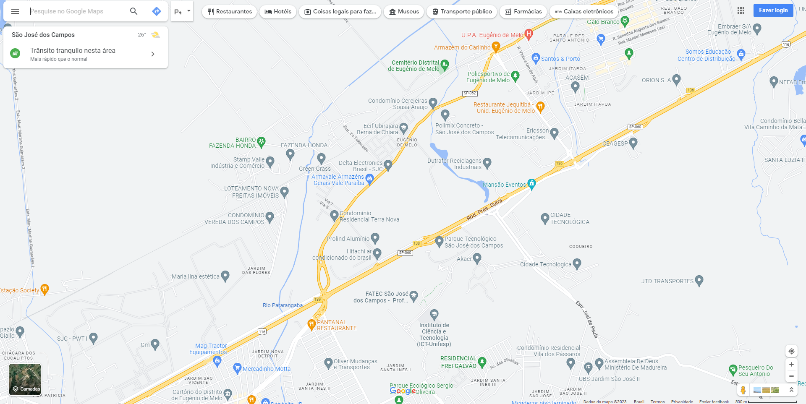
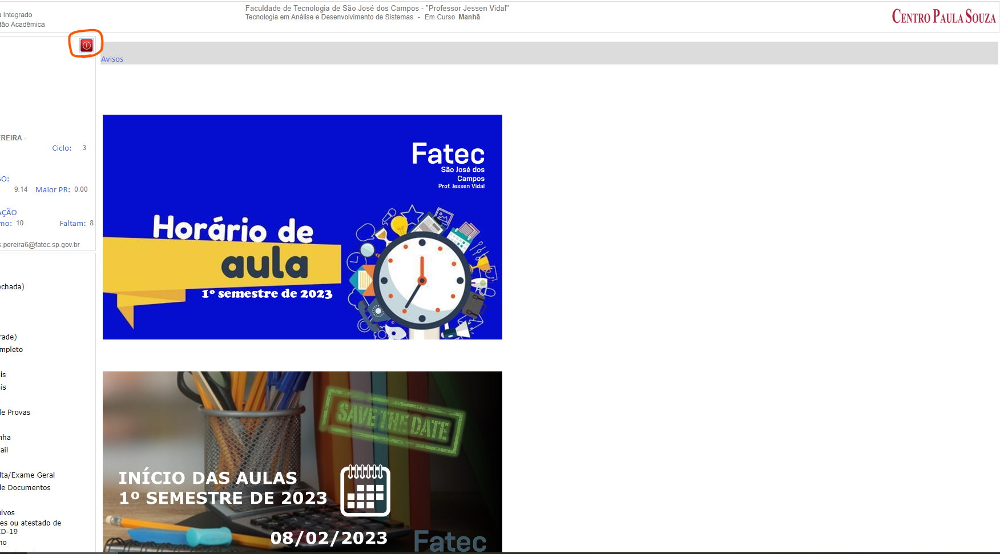

<h1> Avaliação Heuristica GUI </h1>

<h2> Imagem 1: </h2>

 <b> Site com design confuso e desorganizado, existem muitas informações e anúncios, o que dificulta a visibilidade e navegação do usuário. </b> 

<h2> Imagem 2: </h2>

<b> Site com excesso de anúncios desnecessários, site da Globo com propaganda desnecessária, mesmo que o usuário seja assinante do serviço ele ainda recebe anúncios. </b>

<h2> Imagem 3: </h2>

<b> Site com textos muito pequenos dificultando a leitura das informações, nesse caso, é o Siga, site de gerenciamento de matrícula.</b>

<h2> Imagem 4: </h2>

<b> Site com uma navegação muito complicada, este site é de venda de ingressos, caso a pessoa queira ver somente o preço do ingresso ou a as cadeiras disponíveis na sessão, ela terá que responder uma série de protocolos antes de verificar a informação.</b>

<h2> Imagem 5: </h2>

<b> Site com formulários complicados ou desnecessários, esse formulário de feedback possui informações desnecessárias como preenchimento de E-mail e data, coisas que não tem relevância em um questionário de feedback sobre algum serviço ou empresa. </b>

<h2> Imagem 6: </h2>

<b> Aplicativo com interface minimalista, a aplicação mobile do LinkedIn possui um visual minimalista, o que dificulta a usabilidade do sistema. </b>

<h2> Imagem 7: </h2>

<b>Site que não possui ajuda ou documentação, o Siga não possui uma aba de ajuda para que os usuários possam ter mais informações a respeito de como o site funciona. </b>

<h2> Imagem 8: </h2>

<b>Site da Netflix não tem um padrão, ou seja, não existe um menu de navegação que possibilita ao usuário acessar rapidamente conteúdos chaves que possam sanar suas dúvidas ou problemas. </b>

<h2> Imagem 9: </h2>

<b>Site que falta eficiência de uso, o Site de Maps da Google não possui atalhos para serviços de emergências como hospitais, delegacias ou corpos de bombeiros. O Usuário deve procurar no mapa o mais próximo e criar a rota.  </b>

<h2> Imagem 10: </h2>

<b>Site do Siga não tem recursos de prevenção a erro, quando o Usuário clica no botão vermelho de SAIR da plataforma, ele imediatamente é deslogado do sistema, não existe nenhuma mensagem de confirmação, o que pode causar a ações indesejáveis. </b>

